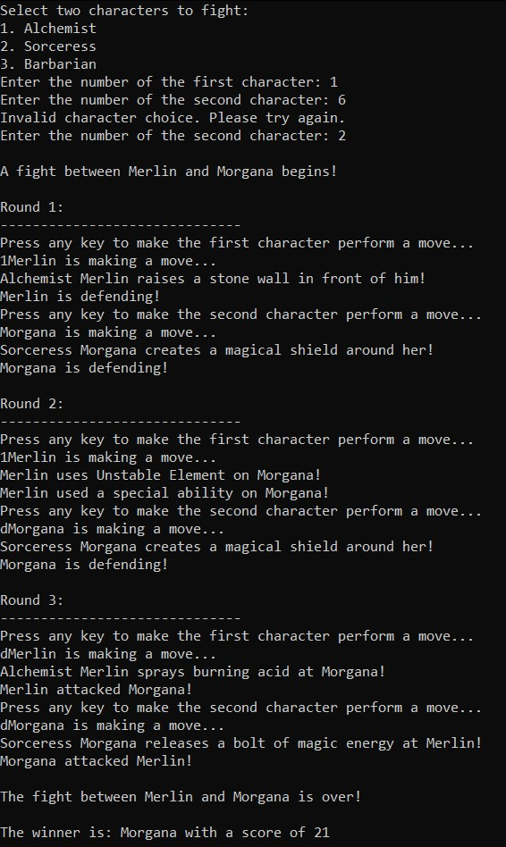

# Legends Kombat

Legends Kombat is a text-based console game. The aim of the game is to make characters battle against each other in a turn-based combat system. 
The game allows users to select characters, perform moves, and determine the winner based on the scores of the characters.

## Key Decisions
__________________________________________________________________________________________________

The code utilized the Factory Method pattern. This provides the ability to create instances of different character types (Alchemist, Sorceress, Barbarian) based on user input. More precisely, the pattern encapsulates the object creation logic within separate factory classes, allowing for flexibility and extensibility in creating objects.

Please refer to an overview of the Factory Method pattern implementation in the code below:

`Abstract CharacterFactory` Class: 
- serves as the abstract base class for character factories. 
- declares the CreateCharacter method, which is responsible for creating character objects. This method is implemented differently in each concrete factory class.

`Concrete CharacterFactory` Classes: 
- There are three concrete factory classes: `AlchemistFactory`, `SorceressFactory`, and `BarbarianFactory`. 
- Each factory class extends the `CharacterFactory` base class and provides its own implementation of the `CreateCharacter` method. 
  These classes instantiate and configure specific character types (Alchemist, Sorceress, Barbarian) based on the user's choice of character. 

Character Creation: 
- The `GetCharacter` method in the Program class utilizes the factory pattern to create character objects. It takes the user's character choice as input and instantiates the appropriate factory class based on that choice. The factory class then creates the corresponding character object and returns it.

The Factory Method pattern decouples the object creation logic from the client code, allowing for easy addition of new character types in the future. If a new character type needs to be added, one can create a new factory class that extends CharacterFactory and implement the CreateCharacter method specific to that character type. The existing code remains unchanged, and can be introduced seamlessly. 

## Usage
__________________________________________________________________________________________________

- Run the compiled executable file or start the application within the IDE.
- The program will prompt the user to choose two characters to fight.
- Select the characters by entering the corresponding numbers.
- The fight begins, and the characters take turns making moves.
- Press any key to make the character perform a move.
- After three rounds, the fight is over, and the winner is determined based on the scores.
- The program displays the winner's name and score and the game ends. 

Please refer to the screenshot of the resulting display below:

